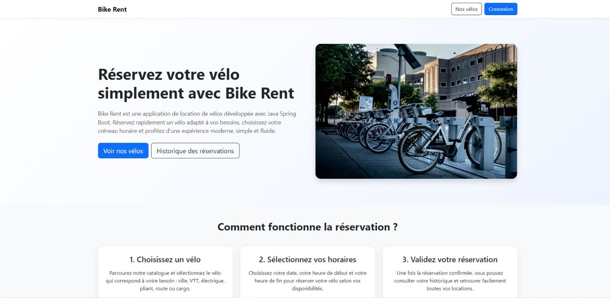

````md
# Bike Rent - Application de réservation de vélos

Bike Rent est une application web développée avec **Java Spring Boot**, **Thymeleaf**, **Spring Security** et **MySQL**.  
Elle permet aux utilisateurs de consulter les vélos disponibles, de réserver un vélo sur une plage horaire donnée, de consulter leur historique, et à l’administrateur d’accéder à un dashboard complet.

## Fonctionnalités

- Authentification utilisateur
- Inscription / connexion / déconnexion
- Catalogue de vélos
- Filtrage par type de vélo
- Détail d’un vélo
- Réservation avec date et heure
- Validation métier sur les réservations
- Calcul du prix total
- Historique des réservations
- Dashboard administrateur
- Mode sombre / clair
- Interface responsive
- Page d’accueil moderne avec témoignages, carrousel, formulaire de contact et footer

## Technologies utilisées

- Java 17
- Spring Boot
- Spring MVC
- Spring Data JPA
- Spring Security
- Thymeleaf
- MySQL
- Bootstrap 5
- CSS3
- JavaScript

## Structure du projet

```text
bikerent/
├── src/
│   ├── main/
│   │   ├── java/
│   │   │   └── com/
│   │   │       └── bikerent/
│   │   │           ├── config/
│   │   │           ├── controller/
│   │   │           ├── entity/
│   │   │           ├── repository/
│   │   │           ├── service/
│   │   │           └── BikerentApplication.java
│   │   └── resources/
│   │       ├── static/
│   │       │   ├── css/
│   │       │   ├── js/
│   │       │   └── images/
│   │       ├── templates/
│   │       │   ├── index.html
│   │       │   ├── bikes.html
│   │       │   ├── bike-details.html
│   │       │   ├── reservation.html
│   │       │   ├── reservations.html
│   │       │   ├── login.html
│   │       │   ├── register.html
│   │       │   └── admin-dashboard.html
│   │       └── application.properties
│   └── test/
├── .gitignore
├── pom.xml
└── README.md
````

## Installation en local

### 1. Cloner le projet

```bash
git clone https://github.com/TON-USERNAME/bikerent-java-springboot.git
cd bikerent-java-springboot
```

### 2. Configurer MySQL

Créer une base de données nommée :

```sql
CREATE DATABASE bikerent_db;
```

### 3. Configurer `application.properties`

```properties
spring.datasource.url=jdbc:mysql://localhost:3306/bikerent_db?createDatabaseIfNotExist=true&serverTimezone=UTC
spring.datasource.username=root
spring.datasource.password=

spring.jpa.hibernate.ddl-auto=update
spring.jpa.show-sql=true
spring.jpa.properties.hibernate.format_sql=true
spring.thymeleaf.cache=false
```

### 4. Lancer l’application

Depuis IntelliJ ou avec Maven :

```bash
mvn spring-boot:run
```

Puis ouvrir :

```text
http://localhost:8080
```

## Comptes et rôles

L’application gère deux types de rôles :

* USER
* ADMIN

L’administrateur peut consulter :

* le nombre d’utilisateurs
* le nombre de réservations
* le nombre de vélos
* le chiffre d’affaires
* la liste des utilisateurs
* la liste complète des réservations

## Aperçu

Application complète de réservation de vélos avec interface moderne, responsive et sécurisée.



## Auteur

**Francis Tabora Afata**

* LinkedIn : [https://www.linkedin.com/in/francis-tabora-afata](https://www.linkedin.com/in/francis-tabora-afata)
* GitHub : [https://github.com/Stuna123](https://github.com/Stuna123)
* Portfolio : [https://portfolioftab.netlify.app/](https://portfolioftab.netlify.app/)

